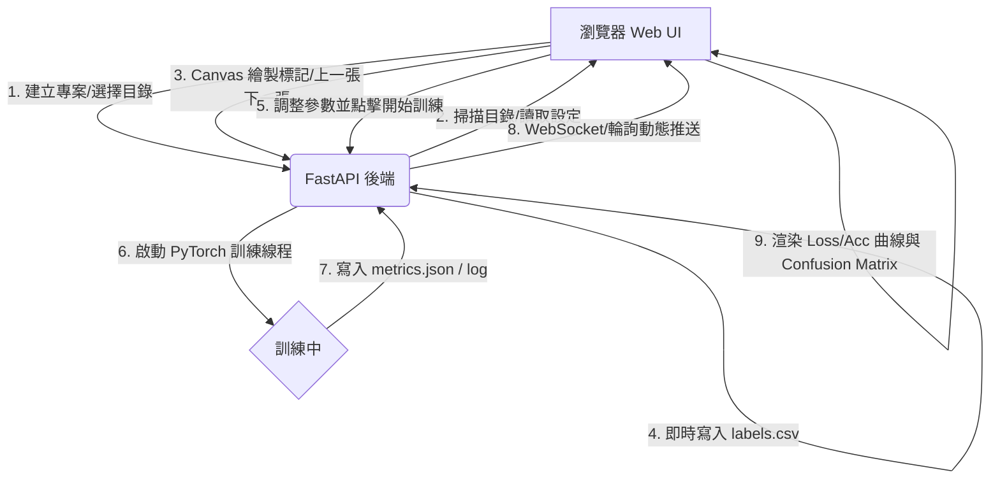

# 決策記錄：影像辨識訓練軟體操作介面設計方案
**時間**：2026-06-08 08:50:00

---

## 1. 背景與需求說明
根據 `README.md` 的架構，本專案旨在為使用者設計並實作一份「桌面版影像辨識訓練工具 (Image Recognition Training UI)」的操作介面。
該介面核心包含三大頁面（首頁、資料頁、標籤頁、訓練頁），並需要支援：
- **專案管理**：建立與讀取 `project_config.json`。
- **資料管理**：Input 資料夾掃描（C:\ 起始）、ZIP/資料夾拖曳匯入、摘要統計、唯讀 Output (`input_path/runs`)。
- **影像標註**：互動式畫布、工具列（選擇、矩形、多邊形、縮放、拖曳）、快捷鍵（A/D 上下張、Ctrl+S 儲存）、類別統計與管理。
- **模型訓練**：資料切分設定、資料增強設定（物理擴充）、訓練前置設定、訓練前檢查、動態訓練監控（Loss/Accuracy 曲線）、訓練結果展示（Confusion Matrix、指標儀表板、錯誤分類檢查）。

---

## 2. 技術選型決策

### 方案 A：Web 視覺化介面 (HTML5/Vanilla CSS/JS) + 輕量級 Python 後端 (FastAPI/Flask) - **[推薦方案]**
*   **說明**：使用 Web 前端技術打造極致美觀的 UI (支援 Dark Mode、Glassmorphism、微動畫)，透過 API 與 Python 後端通訊。Python 後端負責檔案系統掃描、標記儲存及調用 PyTorch/YOLO 進行模型訓練。
*   **優點**：
    1.  **視覺效果極佳**：Web CSS 能輕易做出極具現代感的 UI，比傳統 PyQt/Tkinter 更容易達到「WOW」的使用者體驗。
    2.  **互動流暢**：HTML5 Canvas 實作圖片標記、縮放與拖曳非常成熟，且有豐富的圖表庫（如 Chart.js）可實作動態訓練曲線。
    3.  **前後端解耦**：前端介面可以獨立打包，後端亦可部署於本機或遠端 GPU 伺服器，具備高擴充性。
    4.  **易於打包**：可透過 Electron 打包成桌面 App，或直接使用 Python `webview` 庫載入網頁。
*   **缺點**：
    1.  需要啟動本機伺服器（但可透過 Python 一鍵啟動腳本自動化）。

### 方案 B：純 Python PyQt6 / PySide6 桌面應用
*   **說明**：完全使用 Python PySide6 撰寫 GUI 與核心邏輯。
*   **優點**：
    1.  純 Python 開發，與 AI 訓練核心碼整合最直接。
    2.  原生的操作系統對話框與檔案系統存取。
*   **缺點**：
    1.  **介面美化難度高**：要做出炫酷的 Dark Mode、毛玻璃效果與流暢的過渡動畫，需要撰寫極為複雜的 QSS 與自訂 Widget。
    2.  圖表繪製（PyQtGraph/Matplotlib）的互動性與美觀度不如 Web 圖表庫。

---

## 3. 決策結論
我們選擇 **方案 A (Web 視覺化前端 + Python FastAPI 後端)** 來實作此軟體操作介面。
我們將在 `algorithm/yolo_ui` 底下建立一個高質感的 Web 應用，並提供一個 Python 後端腳本，實現與 YOLO 訓練的實作串接。這能完美符合「視覺震撼 (Wow aesthetics)」與「可實作應用」的雙重指標。

---

## 4. 系統資料流程與架構



### 檔案與目錄結構規劃
在 `d:\software\yolo\algorithm` 底下建立專案：
```text
algorithm/yolo_ui/
├── index.html            # 主畫面 (含首頁、資料、標籤、訓練分頁)
├── css/
│   └── styles.css        # 現代感 CSS (Dark Mode, Glassmorphism, 漸層)
├── js/
│   ├── app.js            # UI 分頁切換與專案管理邏輯
│   ├── data.js           # 資料掃描與 ZIP 處理邏輯
│   ├── canvas.js         # Canvas 圖片標註、縮放、拖曳與畫框邏輯
│   ├── train.js          # 訓練參數設定、動態曲線圖表邏輯
│   └── api.js            # API 請求封裝
└── server.py             # 輕量級 Python FastAPI 後端 (串接 YOLO 與檔案讀寫)
```
